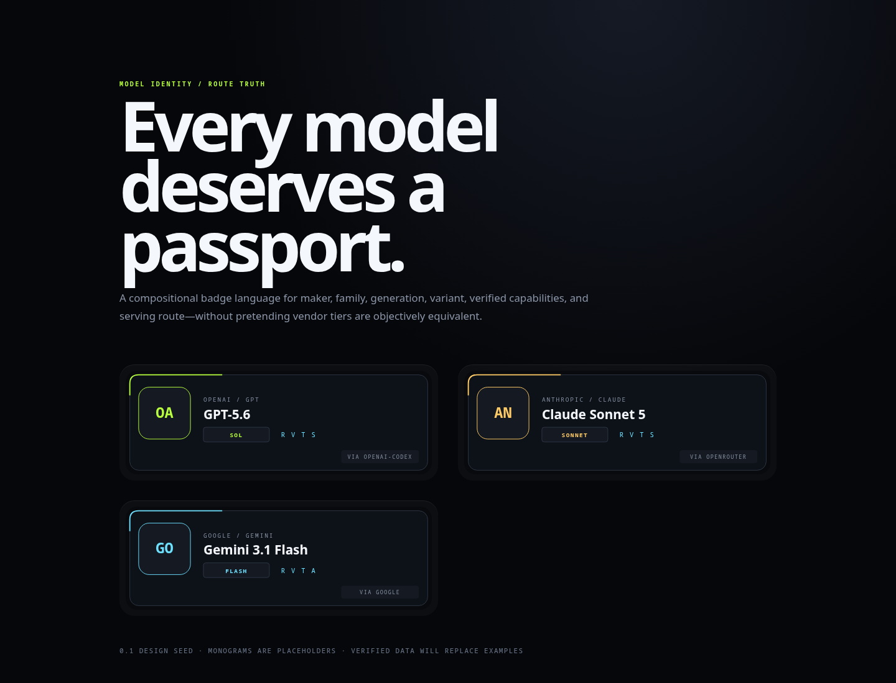

# Hermes Model Passports

A portable visual identity and metadata language for AI models.

**Passport** is the machine-readable identity. **Sigil** is its compact visual badge.

The project separates four things model pickers often collapse:

1. **Maker** — the company or lab responsible for the model.
2. **Model** — canonical family, generation, and variant.
3. **Capabilities** — verified reasoning, tools, modalities, weights, and lifecycle.
4. **Route** — the provider through which an application serves the model.

A Claude model served through Anthropic and the same model served through OpenRouter share a model identity but have different route overlays.

## Design thesis

A sigil should be recognizable before it is readable:



```text
maker mark + model name + variant band + capability pips + route tab
```

It must never imply that provider-specific tiers are objectively equivalent. `Opus`, `Sonnet`, `Haiku`, `Pro`, `Flash`, `Mini`, `Sol`, `Terra`, and `Luna` remain vendor-authored names unless a separately sourced classification says otherwise.

## Repository map

- `DESIGN.md` — normative design language and tokens
- `schema/passport.schema.json` — portable passport schema
- `catalog/examples.json` — representative passports
- `web/gallery.html` — zero-build visual proof
- `src/render.py` — deterministic dependency-free SVG renderer
- `tests/test_render.py` — render invariants

## Quick start

```bash
python src/render.py catalog/examples.json dist
python -m unittest discover -s tests -v
python -m http.server 8000
```

Then open <http://localhost:8000/web/gallery.html>.

## Data resolution

Recommended order: explicit user override → provider plugin declaration → models.dev canonical metadata → live serving-provider metadata → deterministic fallback. Every mutable fact retains provenance and confidence. Unknown never means unsupported.

## Hermes integration

Resolve passports once in Hermes's shared model inventory payload, then let CLI, TUI, Desktop, dashboard, gateway, and ACP render the same descriptor. Badges are presentation-only: IDs, routing, authorization, and capability gates remain structured authorities.

## Status

`0.1 design seed` — deliberately small enough to critique before thousands of models are generated.

## License

MIT. Brand marks and names remain trademarks of their respective owners; inclusion does not imply endorsement. Initial examples use neutral monograms rather than redistributed logos.
